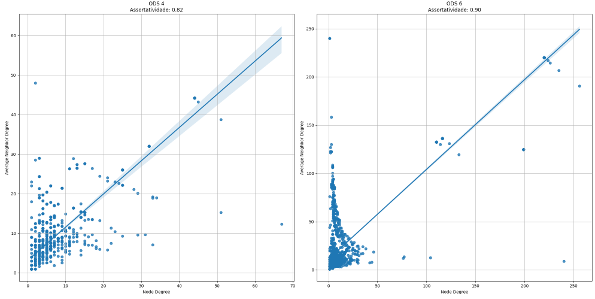

# Análise das Redes

## Gráficos de Assertividade

Um gráfico bipartido sobre a assortatividade em relação ao grau dos nós de uma rede é uma ferramenta visual para entender a relação entre o grau de um nó e o grau médio dos seus vizinhos. A assortatividade mede a tendência de nós de um grafo conectarem-se a outros nós com grau semelhante. A interpretação do gráfico ajuda a identificar padrões de conexão na rede.

| Gráfico de ODS 4 e 6 |
|----------------------|

| Gráfico de ODS 12 e 16 |
|----------------------|

Nestes gráficos, estamos analisando o Grau do Nó (eixo x) e o Grau Médio dos Vizinhos (eixo y). Enquanto o eixo x representa o número de conexões que cada nó possui, o eixo y indica o grau médio dos nós que estão conectados a um nó específico.

No gráfico da ODS 4, encontramos uma assortatividade positiva, onde os pontos formam uma tendência ascendente (os nós de maior grau estão conectados a nós de maior grau, resultando em pontos no quadrante superior direito). Já nos demais, é notada uma maior concentração de agrupamentos na parte inferior esquerda, uma possível explicação seria a representação de novos pesquisadores ou aqueles que publicam pouco, tendo colaborado com outros igualmente novos ou com baixa produtividade.

A reta que passa pelos nós em um gráfico bipartido de assortatividade é uma linha de tendência que ajuda a visualizar a relação geral entre o grau dos nós e o grau médio de seus vizinhos. Ela serve para facilitar a interpretação da assortatividade da rede, indicando se há uma tendência dos nós se conectarem com outros nós de grau semelhante ou diferente. Como possui uma inclinação positiva, isso indica uma correlação positiva entre o grau dos nós e o grau médio de seus vizinhos (assortatividade positiva). Ao redor da reta, é perceptível uma margem sombreada, que representa o intervalo de confiança ou a banda de erro. Elas fornecem informações sobre a variabilidade dos dados em torno da linha de tendência e a confiança que podemos ter na precisão da linha de tendência estimada.

As redes das ODS 4, 6, 12 e 16 apresentam características distintas em termos de assortatividade, componentes conectados e coeficiente de agrupamento. A assortatividade, que mede a tendência de nós de graus semelhantes se conectarem, varia entre as redes, com a ODS 6 e ODS 16 mostrando uma maior tendência de conexões homogêneas em comparação com a ODS 4 e ODS 12. Em termos de componentes conectados, as redes da ODS 6 e ODS 16 possuem menos componentes, indicando uma maior coesão interna e a presença de grandes componentes gigantes que dominam a estrutura da rede. Por outro lado, a ODS 12 apresenta mais componentes conectados, sugerindo uma fragmentação maior e menor coesão. O coeficiente de agrupamento, que reflete o grau de formação de triângulos ou subgrupos coesos dentro da rede, é mais elevado nas redes da ODS 6 e ODS 16, indicando um alto nível de agrupamento local e colaboração entre nós. Em contraste, a rede da ODS 12 possui um coeficiente de agrupamento menor, apontando para uma estrutura menos coesa. Em resumo, as redes da ODS 6 e ODS 16 se destacam por sua alta coesão e agrupamento, enquanto a rede da ODS 12 mostra uma maior fragmentação e menor agrupamento, refletindo as diferentes dinâmicas e desafios de cada objetivo de desenvolvimento sustentável.

## Conclusão

As redes analisadas apresentam diferentes níveis de conectividade e coesão. As redes da ODS 6 e ODS 16 são mais conectadas e coesas, com maiores componentes gigantes e coeficientes de clustering. Já a rede da ODS 12 mostra uma menor coesão com mais componentes conectados e um menor coeficiente de clustering. Esses resultados podem refletir as diferentes características e desafios associados a cada um dos Objetivos de Desenvolvimento Sustentável analisados.

## ✍️ Autoras
- [Quelita Míriam](https://github.com/quelita2) 
- [Rosélia Nascimento](https://github.com/roseliasilva)

---

  📚 DCA0209 - ALGORITMOS E ESTRUTURAS DE DADOS II - T01 (2024.1 - 24M34) 🎓  
  Universidade Federal do Rio Grande do Norte - Departamento de Computação e Automação (DCA). 🏛️

