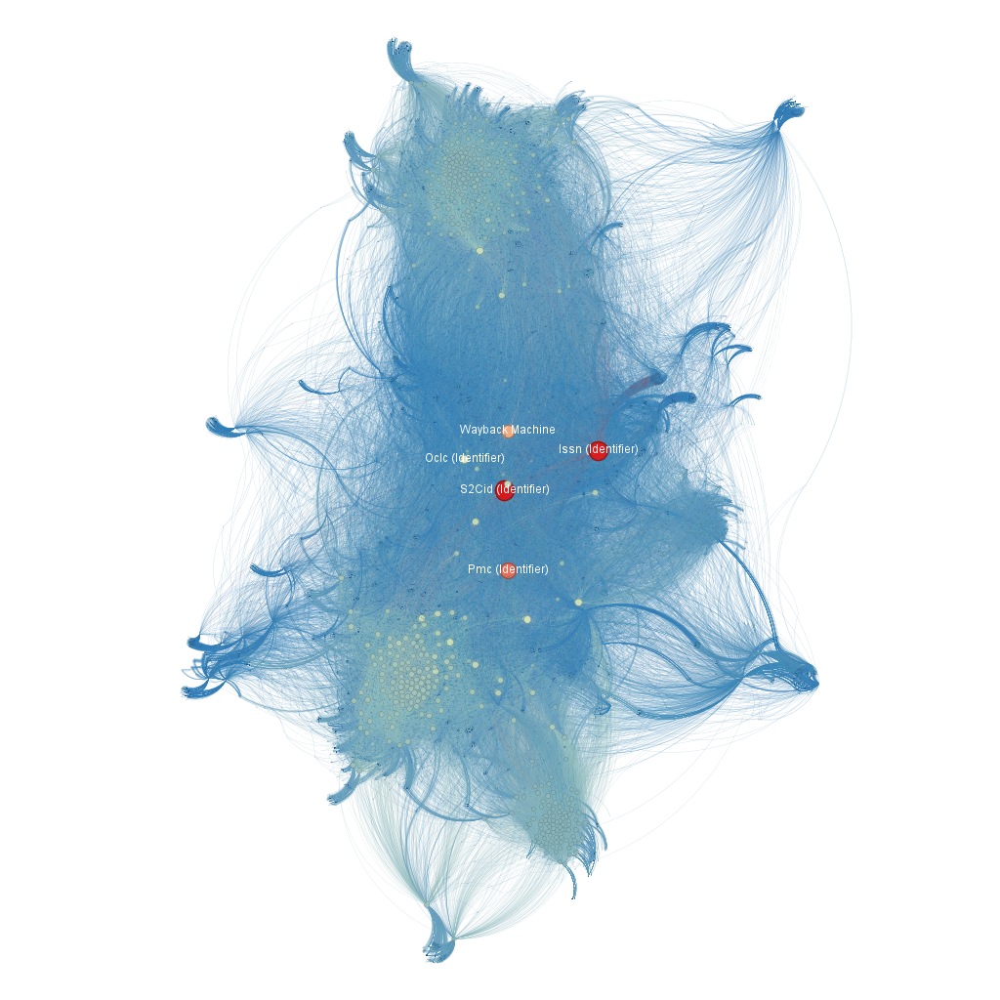
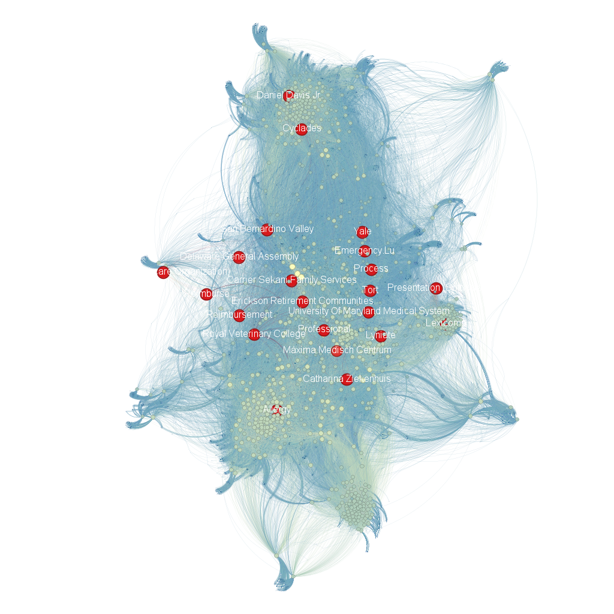
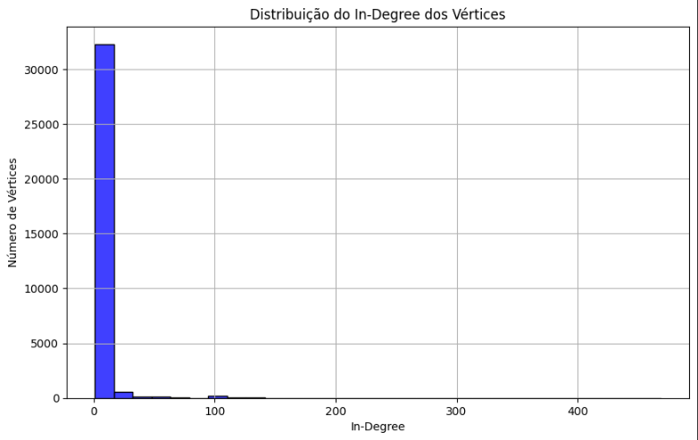
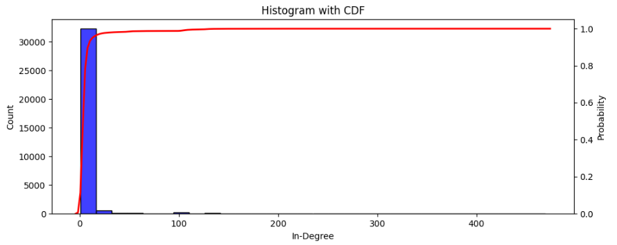
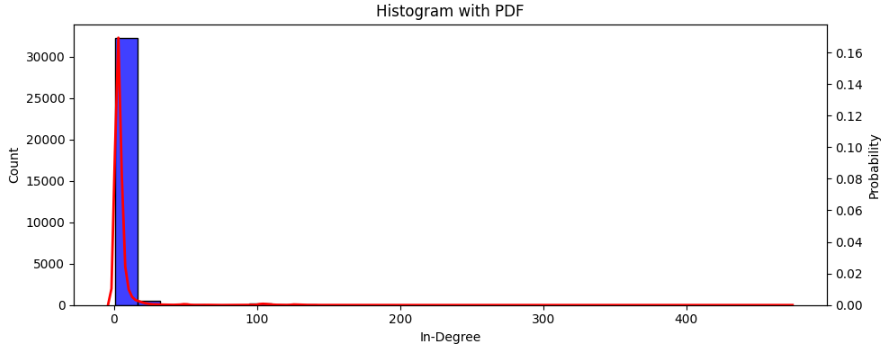
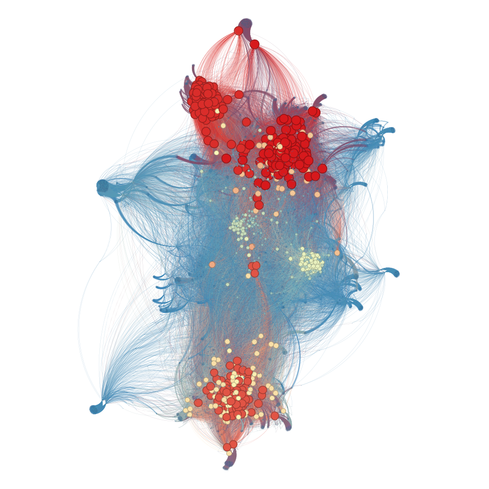

# Trabalho final - Unidade 3

- **Requisito 1:** Gerar uma rede (grafo) dirigida a partir dos links das páginas do Wikipédia considerando a fusão de 3 SEEDs (páginas iniciais). 

- **Requisito 2:** A partir da rede construída gerar uma figura que destaque as propriedades de centralidade da rede utilizando o Gephi, tais como degree centrality, closeness centrality, betweness centraliy e eigenvector centrality. 

- **Requisito 3:** A partir da rede construída gerar uma figura que contenha os gráficos da Cumulative Density Function (CDF) e Probability Density Function (PDF) considerando o in-Degree dos vértices da rede.

- **Requisito 4:** A partir da rede construída gerar uma figura similar no gephi destacando o k-core e o k-shell da rede. O layout é de livre escolha. Os vértices devem ter um tamanho proporcional a propriedade in-degree.

- **Requisito 5:** A rede deverá estar em produção. As cores deverão ser relacionadas ao critério de comunidade e o tamanho do vértice a métrica in-degree.

## Requisito 1

As páginas Wikipedia escolhidas para a construção da rede do trabalho:

- [Telehealth](https://en.wikipedia.org/wiki/Telehealth)
- [Electronic health record](https://en.wikipedia.org/wiki/Electronic_health_record)
- [Health information exchange](https://en.wikipedia.org/wiki/Health_information_exchange)

A partir do algoritmo fornecido pelo professor para transformasse essas páginas em uma rede dirigida. Em seguida, empregamos rotinas do NetworkX para unir as redes individuais em uma única rede, e o Gephi foi utilizado para criar uma visualização.

Na representação final, os nós correspondem às páginas da Wikipédia, e as arestas são os links entre elas. As cores dos nós indicam comunidades, e o tamanho dos nós é proporcional ao in-degree, revelando páginas que são mais citadas.

## Requisito 2

Abaixo, observa-se as imagens que representam as métricas de degree centrality, closeness centrality, betweenness centrality e eigenvector centrality.

| Degree Centrality | Closeness Centrality | Betweeness Centrality | Eigenvector Centrality |
|-------------------|----------------------|----------------------|----------------------|
|||

- **Degree centrality:** Mede o número de conexões diretas de um nó na rede. Os nós com maior in degree, são evidenciados. Esses nós pertencem ao grupo de páginas que possuem muitos links apontando para elas.
- **Closeness centrality:** Avalia a proximidade de um nó em relação aos demais, considerando o comprimento médio dos caminhos mais curtos, ou seja, identifica os nós mais proeminentes, que acabam ficando mais próxima dos nós da rede. Na prática, isso significa que não precisamos navegar muito tempo no Wikipedia para alcançá-los, desde que as páginas pesquisadas sejam relacionadas aos temas considerados por nós neste trabalho.
- **Betweenness centrality:** Indica a importância de um nó na comunicação entre outros nós, identificando quantos caminhos passam por ele. Ele fornece informações sobre a importância de cada nó com base na qualidade de suas conexões em tons mais avermelhados. Esses, quando comparado aos outros, possuem como vizinhos as páginas que mais caracterizam os temas pesquisados na rede.
- **Eigenvector centrality:** Atribui importância aos nós com base na qualidade das conexões que possuem, levando em consideração a relevância dos nós aos quais estão conectados, ou seja, caso você queira navegar de uma página a outra relacionada a esse tema, é muito provável que você passe por uma dessas páginas.

## Requisito 3

| Histograma da rede | 
|--------------------|

| Histograma com CDF | Histograma com PDF | 
|----------------------|----------------------|
||

Ao examinar os gráficos acima, observe que as barras verticais em azul denotam a quantidade de conexões, enquanto a curva em vermelho representa a Função de Densidade de Probabilidade Cumulativa (CDF), à esquerda, e a Função de Densidade de Probabilidade (PDF), à direita. Há uma predominância de conexões de baixo grau, indicando uma quantidade elevada, contrastando com a presença de elementos mais relevantes (graus maiores) em menor quantidade.

Observando a Função Densidade de Probabilidade (FDP), entende-se que a curva mostra a densidade de probabilidade para cada valor da variável. Na base de dados utilizada de links da Wikipedia, há poucas páginas sobre os temas pesquisados que concentram um grande número de links direcionados a elas. Logo, essas páginas emergem como as mais relevantes dentro desses tópicos.

Quanto a Função de Densidade de Probabilidade Cumulativa (CDF), destaca-se a probabilidade cumulativa de que a variável aleatória seja menor igual a um valor específico, e neste caso seria referente aos valores mais relevantes da conexão da rede. 

## Requisito 4

O **k-core** representa o núcleo da rede, formado pelos nós que possuem pelo menos grau k. O **k-shell** identifica o subconjunto de nós removidos para alcançar o próximo k-core. Estas visualizações destacam os componentes mais centrais da rede.

| k-core e k-shell | 
|------------------|

## Requisito 5

A rede construída está em produção no seguinte endereço [Wikipedia Network](https://quelita2.github.io/aedii/)

## ✍️ Autora
- [Quelita Míriam](https://github.com/quelita2) 

---

  📚 DCA0209 - ALGORITMOS E ESTRUTURAS DE DADOS II - T01 (2024.1 - 24M34) 🎓  
  Universidade Federal do Rio Grande do Norte - Departamento de Computação e Automação (DCA). 🏛️

